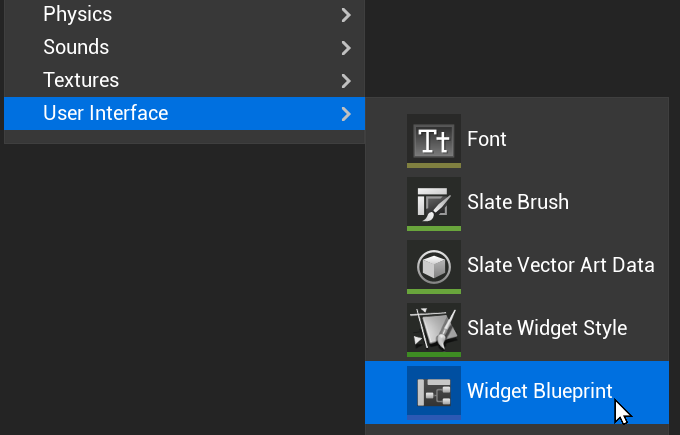
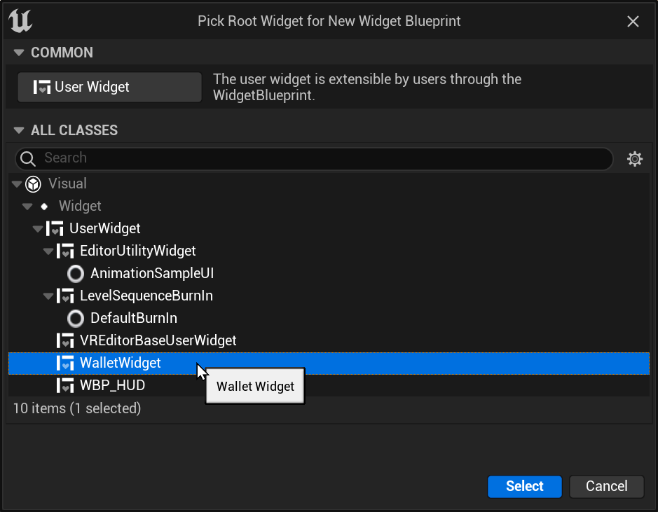
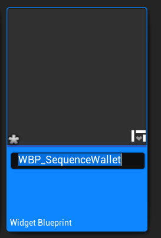
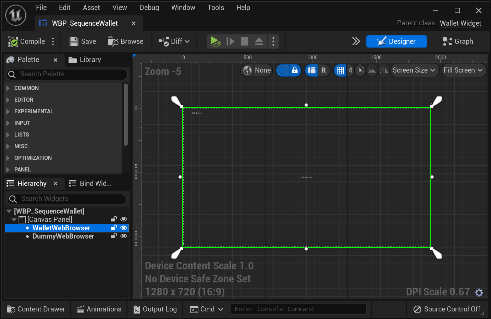
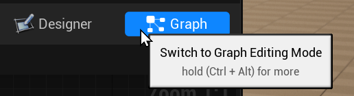
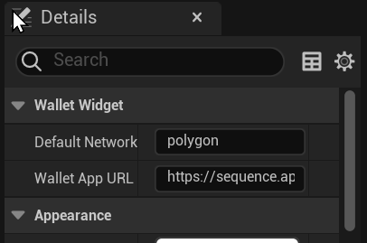

# UnrealSequence

Sequence Wallet plugin for Unreal Engine

# Usage Instructions

## Install
TODO..?

## Setting up UnrealSequence
This setup assumes you're using UMG & Blueprints.

1. Create a Widget Blueprint. 
2. Select "WalletWidget" as the parent class. 
3. Give your blueprint a name, like `WBP_SequenceWallet`. 
4. Add the two required WebBrowser widgets to the blueprint. One must be named `DummyWebBrowser`, the other must be named `WalletWebBrowser`. The easiest way is to put them in a `CanvasPanel`. The `WalletWebBrowser` is the one that will render the Sequence Wallet, so you should probably make it full-size in your `CanvasPanel`. The `DummyWebBrowser` should probably be 0-sized or invisible, unless you're using it to debug Sequence.js code. 
5. If you'd like, you can now customize the default network and wallet app URL by switching to Graph Editing Mode , and changing the Wallet Widget settings under Details.
6. Call IsConnected and Connect from your blueprints!

## Console.log, warning, and errors.
Logs from the browser contexts will show up in your Unreal log under the LogSequence category.